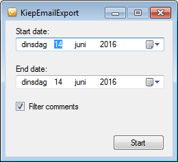

# KiepEmailExport
### C# Forms application for downloading e-mail content from Gmail POP3 into HTML

Takes a date range and puts all e-mail content, grouped by date, in 1 HTML file. The tool is used together with a [Tobii Dynavox Communicator](http://www.tobiidynavox.com/) page set that sends an e-mail every time you clear the text input field. This way a printable log book can be composed.

Put your Gmail account details in [MainForm.cs](MainForm.cs) (and enable POP3 on your Gmail account).

